# 🇮🇳 GovNavigator

### AI-Assisted Indian Government Service Navigator

[](https://react.dev/)
[](https://vitejs.dev/)
[](https://www.python.org/)
[](https://fastapi.tiangolo.com/)
[](https://www.postgresql.org/)
[](https://www.sqlalchemy.org/)
[](https://jwt.io/)
[](https://ai.google.dev/)
[](https://render.com/)
[](https://github.com/)

> GovNavigator is an independent full-stack prototype that helps users discover and explore Indian government-service information through search, service details, saved services, search history, analytics, official-portal links, and AI-assisted guidance.

---

## 🌟 Overview

GovNavigator was built to make government-service discovery easier by bringing several common tasks into one interface.

Users can:

* Select a State or Union Territory
* Search for a government service using keywords or natural-language queries
* View service information such as eligibility, documents, steps, fees, and processing information when available in the dataset
* Save services to favorites
* Review search history
* View search analytics
* Open an associated official government portal
* Ask the AI assistant for general service guidance

GovNavigator is an **independent prototype** and is not affiliated with or endorsed by any government department.

---

# 🚀 Live Application

### Frontend

https://govnavigator.onrender.com

### Backend API

https://govnavigator-backend.onrender.com

### Backend Health Endpoint

```text
GET /
```

The deployed backend currently returns a health response indicating that the API is online and connected to PostgreSQL.

---

# 🔎 Intelligent Search

The search implementation combines several matching techniques, including:

* Exact service-name matching
* Phrase matching
* Service-name word matching
* Category matching
* Description-based matching
* Search synonyms
* Intent detection
* Relevance scoring
* State-based filtering

For example:

```text
"I need proof of my family income"
```

can return:

```text
Income Certificate
```

with a relevance score.

The search implementation is designed to handle both direct service names and more natural descriptions of a user's need.

---

# 🏛️ Service Dataset

The current seeded dataset contains:

```text
36 States / Union Territories
22 Service Categories
792 State/Service Records
792 Records with Official Portal URLs
46 Unique Portal URLs
```

The database was checked after seeding and the resulting audit reported:

```text
792 target records
792 records with URLs
0 extra service rows
36 records per state/UT
36 records per service category
```

The dataset is intended to provide a structured starting point for the prototype. Government information can change, so users should verify current requirements on the relevant official portal.

---

# 🤖 AI-Assisted Guidance

GovNavigator integrates the Google Gemini API for AI-assisted responses.

The AI response is structured around fields such as:

```text
Service Name
Recommendation
Why
Documents
Steps
Important Note
Disclaimer
```

The prompt instructs the model to:

* Identify whether a question is related to an Indian government service
* Avoid recommending unrelated government services
* Avoid inventing official URLs, fees, deadlines, or legal requirements
* Remind users that requirements may vary and should be verified

The AI feature is intended as a guidance layer, not as an authoritative government source.

---

# 🔐 Authentication

The backend includes authenticated user functionality using:

* User registration
* Login
* JWT-based authentication
* Password hashing with Argon2
* Protected user-specific endpoints

Authentication is used for features such as:

```text
Favorites
Search History
Analytics
AI Sessions
```

---

# ⭐ Favorites

Authenticated users can:

```text
Add a service to favorites
View saved services
Check favorite status
Remove a service from favorites
```

Favorites are stored in the PostgreSQL database and associated with the authenticated user.

---

# 🕘 Search History

Authenticated users can:

```text
View previous searches
View the matched service
View match scores
Delete individual history records
Clear search history
View recent searches
```

Search records are stored in PostgreSQL.

---

# 📊 Search Analytics

The analytics API calculates user-level search information including:

```text
Total Searches
Successful Searches
Failed Searches
Success Rate
Average Match Score
Top Queries
Top Services
Top States
Recent Searches
```

The implementation uses SQL aggregation, filtering, grouping, ordering, and user-specific queries.

---

# 🏗️ Architecture

```text
                         ┌───────────────────────┐
                         │         User          │
                         └───────────┬───────────┘
                                     │
                                     ▼
                         ┌───────────────────────┐
                         │   React + Vite UI     │
                         │      JavaScript       │
                         └───────────┬───────────┘
                                     │
                                  REST API
                                     │
                                     ▼
                         ┌───────────────────────┐
                         │    FastAPI Backend    │
                         │        Python         │
                         └─────────┬─────┬───────┘
                                   │     │
                         ┌─────────┘     └──────────┐
                         ▼                          ▼
                ┌──────────────────┐       ┌──────────────────┐
                │   PostgreSQL     │       │   Gemini API     │
                │   Neon Database  │       │ AI Assistance    │
                └──────────────────┘       └──────────────────┘
```

---

# 🔄 Application Flow

```text
Register / Login
       │
       ▼
Select State / UT
       │
       ▼
Search Service
       │
       ▼
Ranked Results
       │
       ├──────────────► Service Details
       │
       ├──────────────► Favorite
       │
       ├──────────────► Search History
       │
       ├──────────────► Analytics
       │
       └──────────────► Official Portal
                             
                         AI Guidance


```

---

# 🖼️ Screenshots

The following screenshots show the main user flows and features of GovNavigator.

### 🔐 Authentication

| Login                                | Register                                   |
| ------------------------------------ | ------------------------------------------ |
| 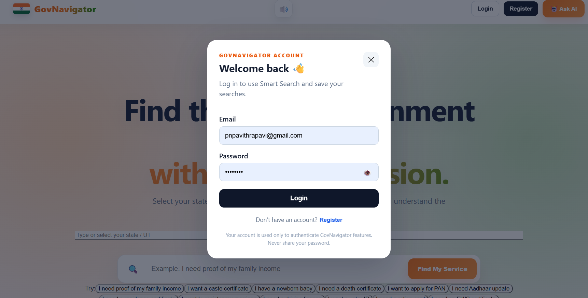 | 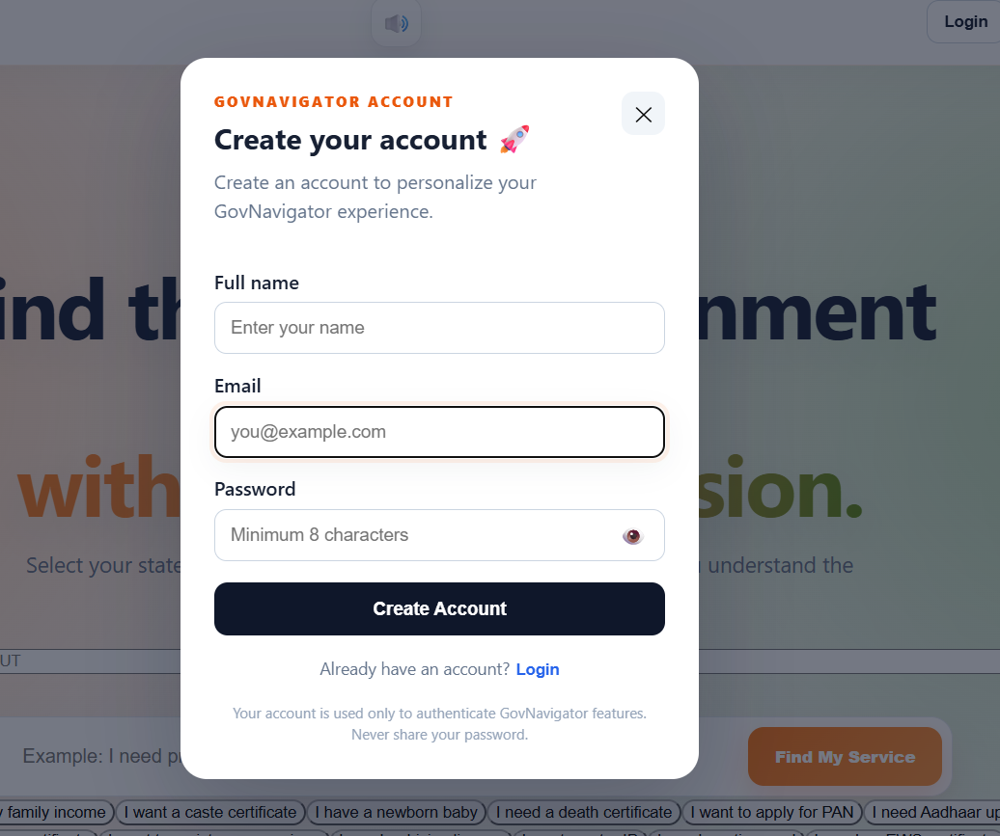 |

### 📊 Dashboard

| Dashboard Overview                            | Dashboard Details                                     |
| --------------------------------------------- | ----------------------------------------------------- |
| 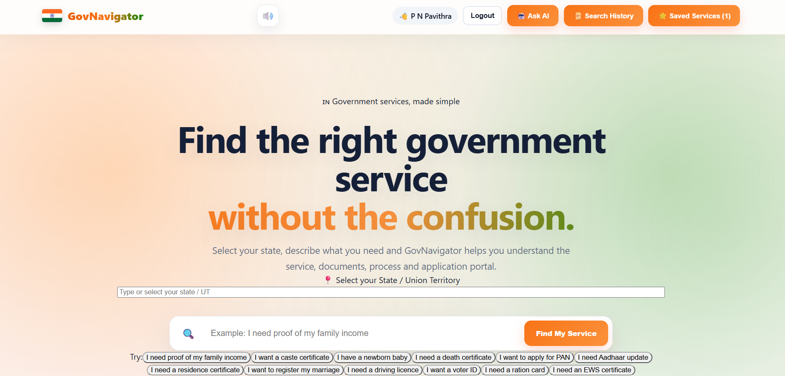 | 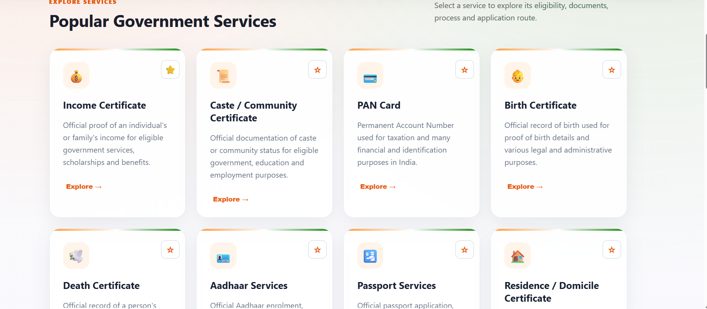 |

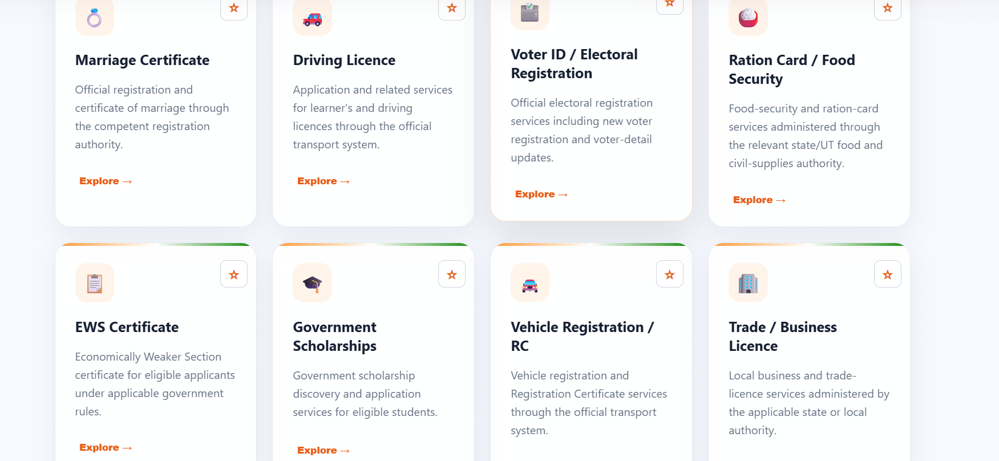

### 🤖 AI Assistant

| AI Assistant                                       | Ask AI — View 1                         |
| -------------------------------------------------- | --------------------------------------- |
| 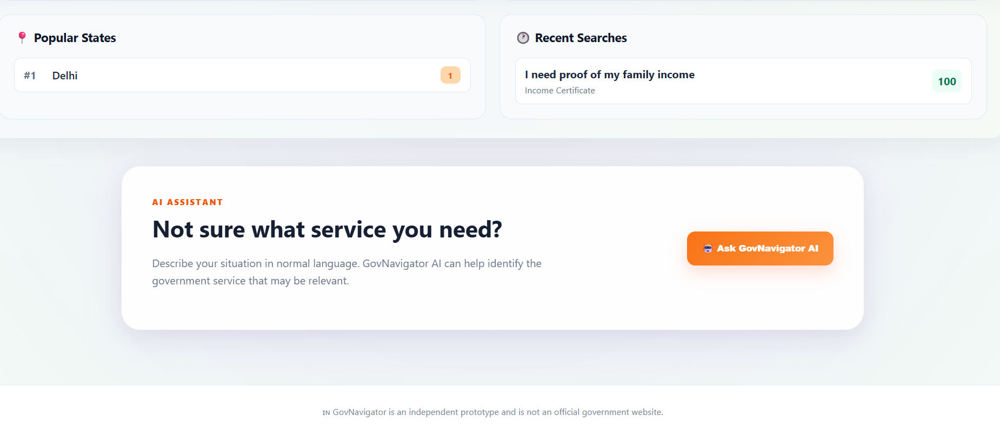 | 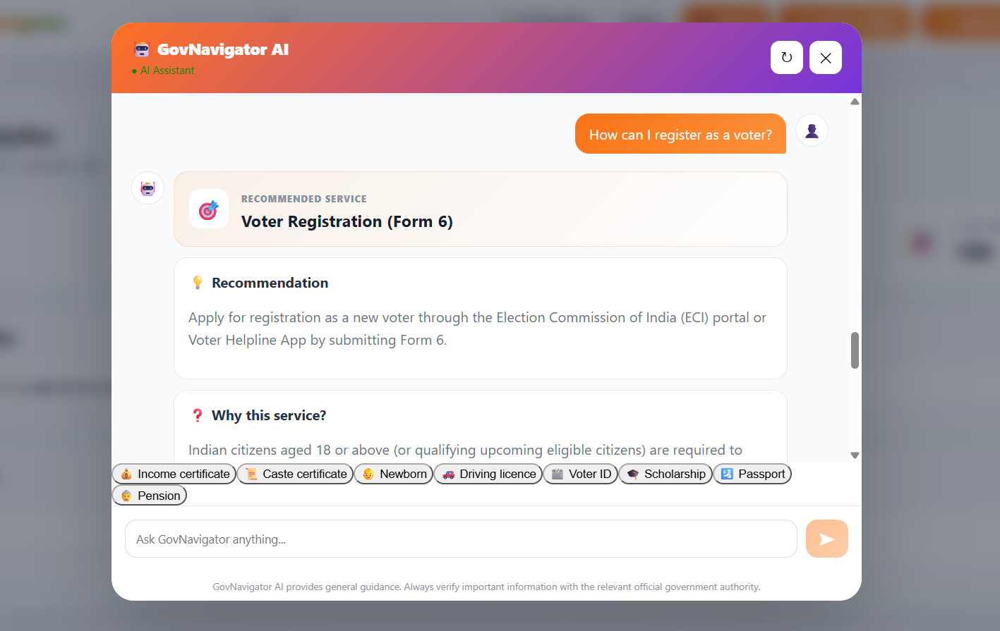 |

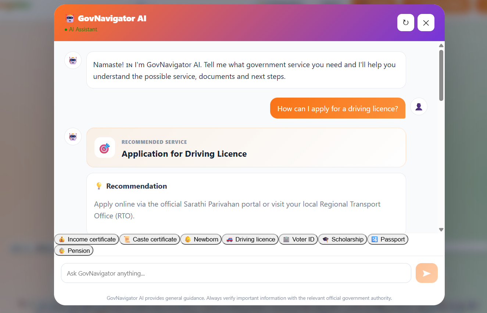

### 🔎 Find My Service

| Service Search                                       | Search Results                                                |
| ---------------------------------------------------- | ------------------------------------------------------------- |
| 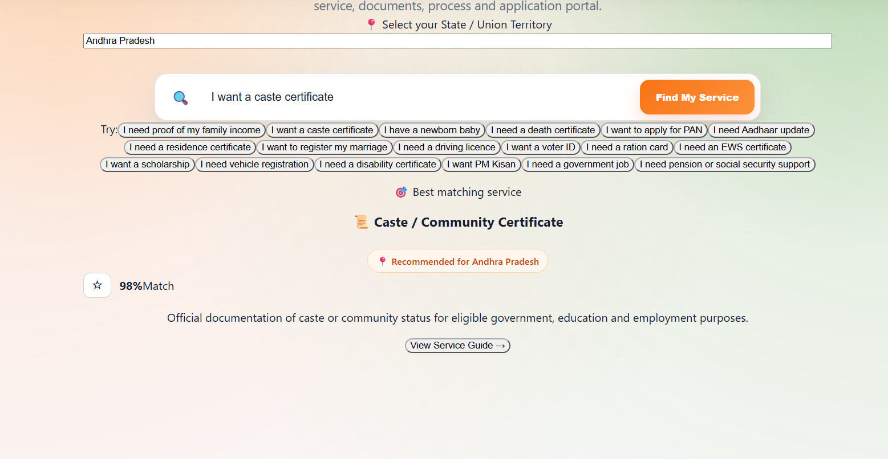 | 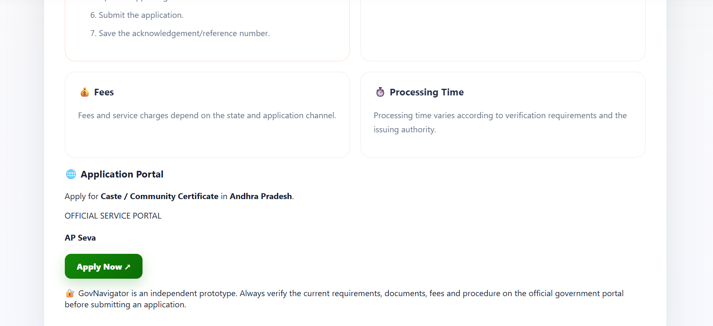 |

### 📈 Search Analytics & History

| Search Analytics                                           | Search History                                         |
| ---------------------------------------------------------- | ------------------------------------------------------ |
| 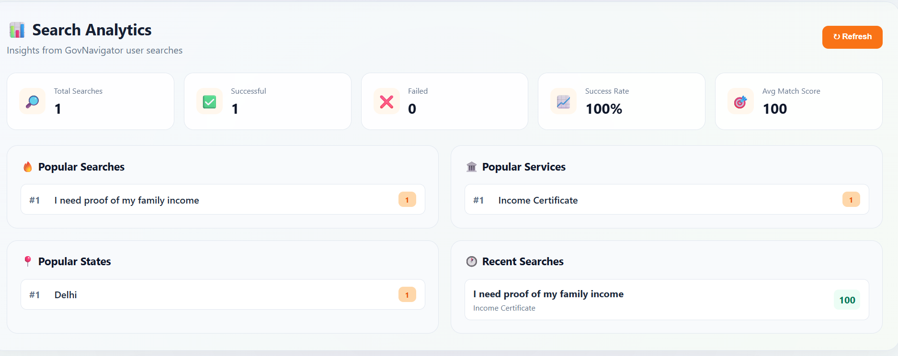 | 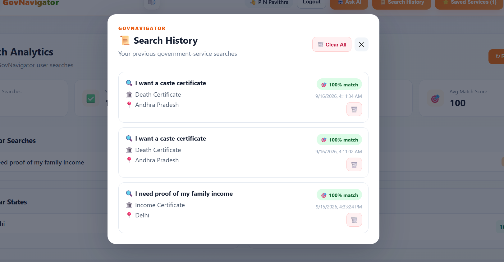 |

### ⭐ Saved Services

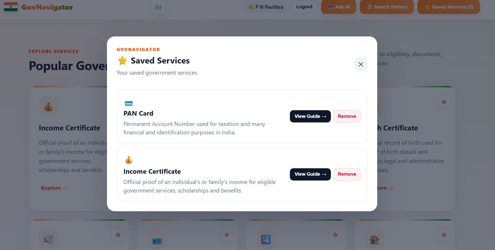

# 🛠️ Technology Stack

## Frontend

| Technology | Role                          |
| ---------- | ----------------------------- |
| React      | User interface                |
| Vite       | Development and build tooling |
| JavaScript | Frontend logic                |
| Axios      | HTTP/API communication        |
| CSS        | Styling and layout            |

## Backend

| Technology        | Role                    |
| ----------------- | ----------------------- |
| Python            | Backend programming     |
| FastAPI           | REST API                |
| SQLAlchemy        | ORM and database access |
| PyJWT             | JWT authentication      |
| pwdlib + Argon2   | Password hashing        |
| Google Gemini API | AI-assisted guidance    |

## Database & Deployment

| Technology | Role                |
| ---------- | ------------------- |
| PostgreSQL | Relational database |
| Neon       | Hosted PostgreSQL   |
| Render     | Application hosting |
| GitHub     | Source control      |

---

# 📁 Project Structure

```text
govnavigator/
│
├── backend/
│   ├── main.py
│   ├── database.py
│   ├── models.py
│   ├── schemas.py
│   ├── seed_data.py
│   ├── seed_services.py
│   ├── requirements.txt
│   └── ...
│
├── frontend/
│   ├── src/
│   ├── public/
│   ├── package.json
│   └── ...
│
├── docs/
│   └── screenshots/
│
├── .gitignore
└── README.md
```

---

# 💻 Local Setup

## 1. Clone the repository

```bash
git clone https://github.com/Pavithrapavi25/govnavigator.git
cd govnavigator
```

## 2. Backend setup

```powershell
cd backend
python -m venv venv
.\venv\Scripts\Activate.ps1
pip install -r requirements.txt
```

## 3. Environment variables

Create:

```text
backend/.env
```

Example:

```env
DATABASE_URL=your_postgresql_connection_string
JWT_SECRET=your_jwt_secret
GEMINI_API_KEY=your_gemini_api_key
APP_ENV=development
FRONTEND_URL=http://localhost:5173
```

Do not commit real credentials or API keys.

## 4. Start the backend

```powershell
uvicorn main:app --reload
```

Default local backend:

```text
http://127.0.0.1:8000
```

## 5. Start the frontend

```powershell
cd frontend
npm install
npm run dev
```

Default local frontend:

```text
http://localhost:5173
```

---

# 🗃️ Database Seeding

The project includes scripts for preparing the database:

```powershell
cd backend

python seed_data.py

python seed_services.py
```

The service seeder includes reconciliation and audit logic for the expected service dataset.

---

# 🔧 Engineering Work

The project involved practical debugging and implementation work across the full stack, including:

* PostgreSQL configuration
* Local versus hosted database configuration
* Render deployment configuration
* JWT authentication
* Password hashing
* Service-data seeding
* Search relevance logic
* Database indexing
* AI API integration
* AI error handling
* Production debugging

The service seeding process was also optimized so existing service records can be loaded once and matched in memory rather than performing a separate database lookup for every state/service combination.

---

# 🧪 Verification Performed

The following areas were tested during development and deployment:

```text
Registration
Login
Service Search
Service Details
Favorites
Search History
Search Analytics
Official Portal Links
AI Assistant
```

The database audit reported:

```text
36 / 36 States or UTs
22 / 22 Service Categories
792 / 792 Target Records
792 / 792 Records with URLs
0 Extra Service Rows
```

These results reflect the database and application checks performed during development; government portal availability and third-party AI availability can change independently.

---

# 🎯 Skills Demonstrated

### Programming

* Python
* JavaScript
* SQL

### Backend Development

* FastAPI
* REST APIs
* SQLAlchemy
* Authentication
* JWT
* Argon2

### Database

* PostgreSQL
* Relational modelling
* Querying
* Aggregation
* Indexing
* Database seeding

### AI

* Gemini API integration
* Prompt design
* Structured JSON responses
* AI error handling
* Response-latency tuning

### Deployment

* Git
* GitHub
* Render
* Neon
* Environment-variable configuration
* Production debugging

---

# 🚀 Future Improvements

Possible future work includes:

* More service categories
* Multilingual support
* Regional-language AI assistance
* Automated portal availability checks
* Improved accessibility
* Notifications and reminders
* More advanced service recommendations
* Production monitoring and observability

---

# ⚠️ Disclaimer

GovNavigator is an independent prototype and is not affiliated with or endorsed by any Indian government department.

Government service requirements, fees, eligibility criteria, documents, processing times, and procedures may change.

Users should verify current information through the relevant official government authority or portal before applying.

GovNavigator does not submit government applications on behalf of users.

---

# 👩‍💻 Author

## Pavithra

**BE Graduate | AI & Data Science**

Areas of interest:

```text
Artificial Intelligence
Data Science
Python
SQL
Full-Stack Development
```

---

# 📫 Project Links

🌐 **Live Application**
https://govnavigator.onrender.com

⚙️ **Backend API**
https://govnavigator-backend.onrender.com

📂 **GitHub Repository**
https://github.com/Pavithrapavi25/govnavigator

---

## ⭐ Project Summary

GovNavigator brings together:

```text
React
+
FastAPI
+
Python
+
PostgreSQL
+
SQLAlchemy
+
JWT Authentication
+
Search & Ranking
+
AI Integration
+
Analytics
+
Cloud Deployment
```

into a single application focused on making government-service discovery easier for users.
